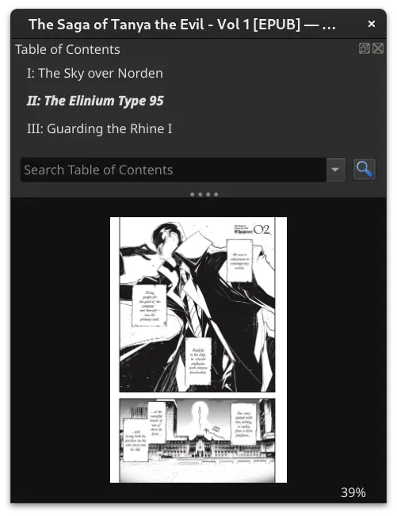

# comic-epub


[](LICENSE)

## About

Command line tool for combining comic-images into epub. \
First image will be used as the cover.

## Install

```bash
go install github.com/palsmo/comic-epub@latest
```

## Usage

```
comic-epub [OPTIONS]... [DIR] 'or [FILE FILE...]
```

### - example

```bash
comic-epub # prints info
```

**\\** - line continuation \
**,** - stop read args (when flag has no arg limit) \
default \ same effect without \
\
(standing in dir with images)

```bash
comic-epub \
-t "The Epic Comic" -a "Stan Lee" \
-d "Story of epic proportions!" \
-c 7:"I: The Intro" 42:"II: The Epic" , \ # don't forget ','
-l "eng" \    # default
-bg "#000" \  # default
-out . \      # default
.
```

### - flags

```
-t      specify the book's title
-a      specify the book's author
-d      specify the book's description
-c      specify the book's chapters, args - P:[TITLE]
-l      specify the book's language, ISO 639-[2,3] format
-bg     specify the book's page background color,
           needs to be valid css color (e-reader may override)
-out    specify the output path, default is current dir
```

## Screenshots

(viewed in calibre)

<div>
    
    
    
</div>
